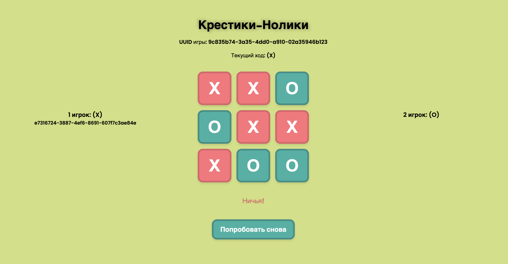

# Tictactoe (Крестики-Нолики)

## Содержание
1. [О проекте](#о-проекте)
2. [Особоенности проекта](#особоенности-проекта)
3. [Сборка](#сборка)

## О проекте

В данном учебном проекте "Школы 21" было реализовано веб-приложение "Крестики-Нолики" на языке Java. В программе использовались:
* Java 18 — основной язык программирования;
* Gradle (DSL-Kotlin) — система сборки проекта;
* Spring Framework:
  * Spring Boot — упрощение конфигурации и запуска приложения;
  * Spring MVC — реализация RESTful API;
  * Spring Data JPA — взаимодействие с PostgreSQL через ORM Hibernate;
  * Spring Security — управление доступом и аутентификацией с использованием JWT;
  * Spring WebSocket — поддержка WebSocket-соединений для обмена данными в реальном времени;
* PostgreSQL — база данных для хранения пользователей и информации о партиях;
* JWT (Json Web Token) — аутентификация и авторизация пользователей;
* Thymeleaf — серверная генерация страниц;
* JavaScript, HTML, CSS — для визуализации на клиентской стороне.

*Демонстрация работы игры*

 ### Список возможностей программы:

*Игровое поле, демонстрирующее ничью при игре с компьютером*

